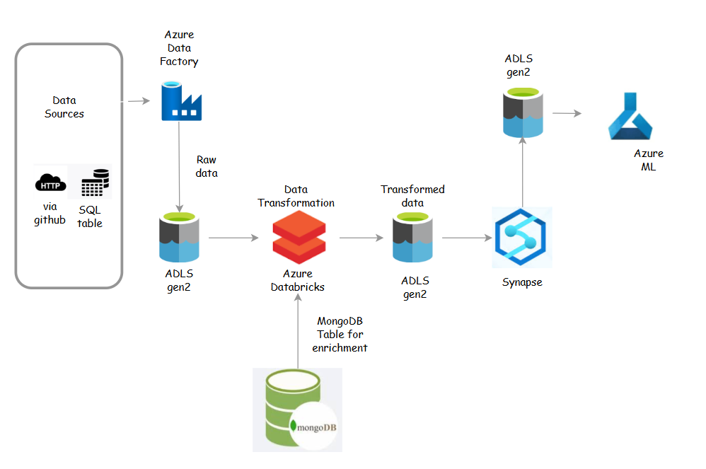
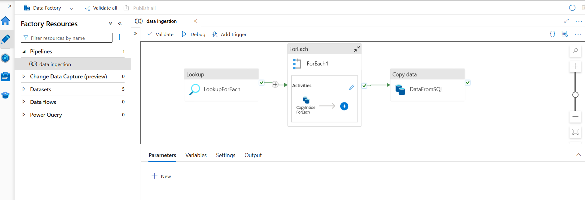

# Azure Medallion Data Pipeline Architecture

This project demonstrates the implementation of a **Medallion Data Pipeline Architecture** using **Microsoft Azure cloud services**.  
The pipeline ingests data from multiple sources, performs scalable transformations and enrichment, and prepares curated data for analytics and machine learning use cases.

---

## Project Overview

The goal of this project is to build an **end-to-end data engineering pipeline** following the **Bronze → Silver → Gold** medallion pattern to ensure data quality, scalability, and reusability.

The pipeline supports:
- Multi-source data ingestion
- Distributed data processing and enrichment
- Structured data layers for analytics and ML consumption

---

## Architecture Flow

1. **Data Ingestion**
2. **Bronze Layer (Raw Data)**
3. **Data Transformation & Enrichment**
4. **Silver Layer (Cleaned Data)**
5. **Serving Layer using Azure Synapse**
6. **Gold Layer (Curated Data)**
7. **Azure Machine Learning (Downstream Use)**

---

## Data Ingestion

Data is ingested using **Azure Data Factory (ADF)** from the following sources:

- **HTTP REST API**  
  - GitHub API accessed via HTTPS requests
- **Relational SQL Table**
  - Structured data extracted from a SQL database

ADF orchestrates the ingestion pipelines and loads raw data into Azure Data Lake Storage.

---

## Bronze Layer (Raw Data)

- Storage: **Azure Data Lake Storage Gen2**
- Purpose: Preserve raw, unprocessed data
- Folder structure:
- Data is stored **as-is** without transformations for traceability and reprocessing.

---

## Data Transformation & Enrichment

Data transformation is performed using **Azure Databricks**:

- Data cleaning and schema standardization
- Business-level transformations
- **Data enrichment** by joining with an **external MongoDB table**
- MongoDB is hosted externally
- Used to enhance records with additional attributes

Databricks enables scalable distributed processing using Spark.

---

## Silver Layer (Transformed Data)

- Storage: **Azure Data Lake Storage Gen2**
- Folder structure:
- Contains:
- Cleaned
- Transformed
- Enriched data
- Data in this layer is analytics-ready and consistent.

---

## Azure Synapse Analytics (Serving Preparation)

- Azure Synapse SQL is used to:
- Create **SQL views** on top of Silver data
- Apply filtering and projections
- Expose only **required fields** for end users

This makes the data easily consumable for reporting and downstream applications.

---

## Gold Layer (Serving Layer)

- Storage: **Azure Data Lake Storage Gen2**
- Folder structure:
- Contains:
- Highly curated
- Aggregated
- Business-ready datasets
- Designed for:
- BI tools
- Reporting
- Machine Learning consumption

---

## Azure Machine Learning – Delay Prediction Model

Azure Machine Learning is used to build a **binary classification model** to predict whether an order is likely to be **delayed or delivered on time**.

- Algorithm used: **XGBoost**
- Input features are derived from the **Gold layer** of the Medallion architecture
- Data is preprocessed and split into training and testing datasets
- The model outputs a prediction indicating **delay risk (Yes/No)**

This model enables proactive decision-making by identifying high-risk orders and can be further integrated with alerting or operational workflows.

---

## Tech Stack

- Azure Data Factory
- Azure Data Lake Storage Gen2
- Azure Databricks
- Azure Synapse Analytics
- Azure Machine Learning
- MongoDB (External)
- MySQL
- Python
- Apache Spark

---

## Key Features

- End-to-end Medallion Architecture
- Multi-source ingestion (API + SQL)
- Scalable Spark-based transformations
- External data enrichment
- Analytics and ML-ready data layers

---

## Future Enhancements

- Implement data quality checks using Delta Live Tables
- Add monitoring and alerting using Azure Monitor
- Integrate CI/CD for Databricks notebooks
- Add Power BI dashboards on top of Gold layer

---

## Author

**Nihal R**

